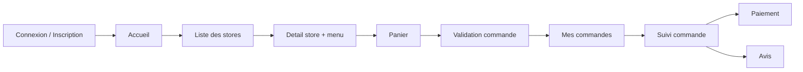

# DeliveryApp - Frontend Workflow (Documentation)

Ce document decrit le workflow front complet pour un produit type Uber Eats, aligne sur le backend actuel.

## 1. Objectif

Decrire le comportement de l'application front:

- parcours client de bout en bout
- ecrans attendus
- appels API associes a chaque ecran
- cas d'erreur a gerer

Depuis cette version, le front fonctionne en mode role-based avec JWT:

- `Customer`: catalogue, panier, checkout, mes commandes
- `Courier`: board commandes + suivi
- `Admin`: gestion stores + moderation comptes + supervision

## 1.1 Contexte architecture

- Runtime actuel: Frontend Blazor Server + API .NET + SQL Server.
- Cosmos DB: non implemente dans le projet actuel.
- Reference architecture globale: `docs/architecture/architecture-document.fr.md`.

## 2. Perimetre fonctionnel

Perimetre inclus:

- connexion/inscription client (session front)
- consultation des stores et produits
- creation d'une commande
- historique des commandes du client connecte
- suivi de commande
- paiement
- avis apres livraison

Perimetre hors scope (pour l'instant):

- authentification OAuth externe
- notifications push temps reel
- geolocalisation carte

## 3. Representation du parcours front



## 4. Ecrans et API associees

| Ecran front | Action utilisateur | Endpoint backend | Methode |
|---|---|---|---|
| Connexion/Inscription | connexion ou inscription self-service | `/api/auth/login`, `/api/auth/register/customer`, `/api/auth/register/courier` | POST/POST/POST |
| Accueil | verifier que le service est en ligne | `/health` | GET |
| Liste stores | afficher les restaurants | `/api/stores` | GET |
| Detail store | afficher le menu d'un store | `/api/stores/{storeId}/products` | GET |
| Panier/Checkout | choisir une adresse existante ou en creer une nouvelle, puis creer la commande | `/api/account/addresses`, `/api/orders` | GET/POST/POST |
| Mes commandes | afficher les commandes du client connecte | `/api/orders/mine` | GET |
| Suivi commande | lire l'etat de la commande | `/api/orders/{id}` | GET |
| Paiement | payer la commande | `/api/orders/{orderId}/payments` | POST |
| Historique paiement | afficher les paiements | `/api/orders/{orderId}/payments` | GET |
| Avis | publier un avis | `/api/orders/{orderId}/reviews` | POST |
| Historique avis | afficher les avis | `/api/orders/{orderId}/reviews` | GET |

Notes:

- Pour les operations livreur: `PATCH /api/orders/{orderId}/assign-courier`, `PUT /api/orders/{id}`.
- Il existe aussi une variante modulaire via `/api/modules/*`.

## 5. Script de demo front (scenario nominal)

Preconditions:

1. backend demarre
2. base alimentee (seed SQL deja execute)
3. au moins 1 store, plusieurs produits
4. 1 compte customer inscrit + 1 compte courier inscrit

Scenario:

1. L'utilisateur ouvre l'app et passe par la page `Connexion / Inscription`.
2. Il ouvre la liste des stores puis un store et charge ses produits.
3. Il ajoute des produits au panier (quantites > 0).
4. Il valide la commande.
5. L'app redirige vers le suivi et la commande apparait dans `Mes commandes`.
6. Le courier s'assigne la commande.
7. Le courier fait progresser le statut jusqu'a `Delivered`.
8. Le client paie la commande (montant exact).
9. Le client poste un avis.

## 6. Payloads de reference

### 6.1 Creer une commande

`POST /api/orders`

```json
{
  "customerId": 2,
  "storeId": 2,
  "deliveryAddressId": 2,
  "items": [
    { "productId": 6, "quantity": 2 },
    { "productId": 7, "quantity": 1 }
  ]
}
```

### 6.2 Assigner un courier

`PATCH /api/orders/{orderId}/assign-courier`

```json
{
  "courierId": 1
}
```

### 6.3 Mettre a jour le statut commande

`PUT /api/orders/{orderId}`

```json
{
  "status": 2,
  "courierId": 1
}
```

Note:
- pour atteindre `Delivered`, le front doit enchaîner plusieurs mises a jour de statut (progression `N -> N+1`).

### 6.4 Payer la commande

`POST /api/orders/{orderId}/payments`

```json
{
  "method": 0
}
```

### 6.5 Poster un avis

`POST /api/orders/{orderId}/reviews`

```json
{
  "rating": 5,
  "comment": "Livraison rapide et commande chaude."
}
```

## 7. Regles metier a refleter dans le front

### 7.1 Statuts de commande

| Valeur | Statut |
|---|---|
| 0 | Pending |
| 1 | Accepted |
| 2 | Preparing |
| 3 | ReadyForPickup |
| 4 | PickedUp |
| 5 | OutForDelivery |
| 6 | Delivered |
| 7 | Cancelled |

Regle de transition:

- progression pas a pas (N -> N+1)
- `Cancelled` autorise tant que la commande n'est pas deja `Delivered` ou `Cancelled`
- affecter un courier sur une commande `Pending` la fait passer `Accepted`

### 7.2 Paiement

- Le montant est impose automatiquement par le backend a partir du `TotalPrice` de la commande.
- Un seul paiement `Completed` par commande.

### 7.3 Avis

- Un avis est autorise uniquement si la commande est `Delivered`.
- Un seul avis par commande.

## 8. Gestion des erreurs front (obligatoire)

| Code HTTP | Cas typique | Attendu front |
|---|---|---|
| 400 | payload invalide, IDs <= 0 | afficher message de validation, rester sur le formulaire |
| 404 | commande/store/client introuvable | afficher "ressource introuvable", proposer retour |
| 409 | conflit metier (transition interdite, avis deja cree, deja payee) | afficher message metier non bloquant app |
| 500 | erreur interne | afficher message generique + bouton retry |

## 9. Definition of done du front

Le front est valide si:

1. le parcours client complet est demonstrable de la liste store jusqu'a l'avis
2. chaque ecran appelle les bons endpoints et gere loading/success/error
3. les statuts commande sont lisibles et coherents avec les transitions backend
4. les erreurs 400/404/409/500 sont gerees proprement
5. le scenario tourne sans modification backend
