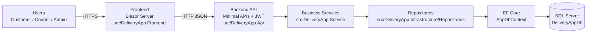
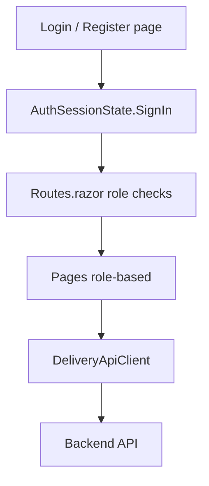
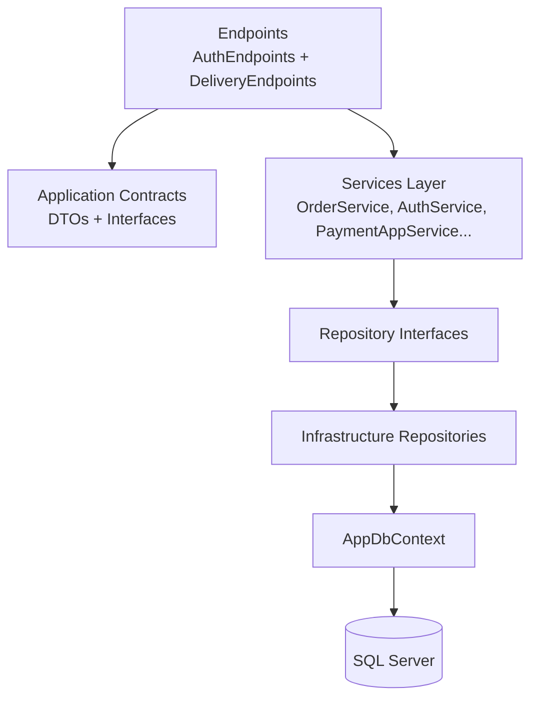
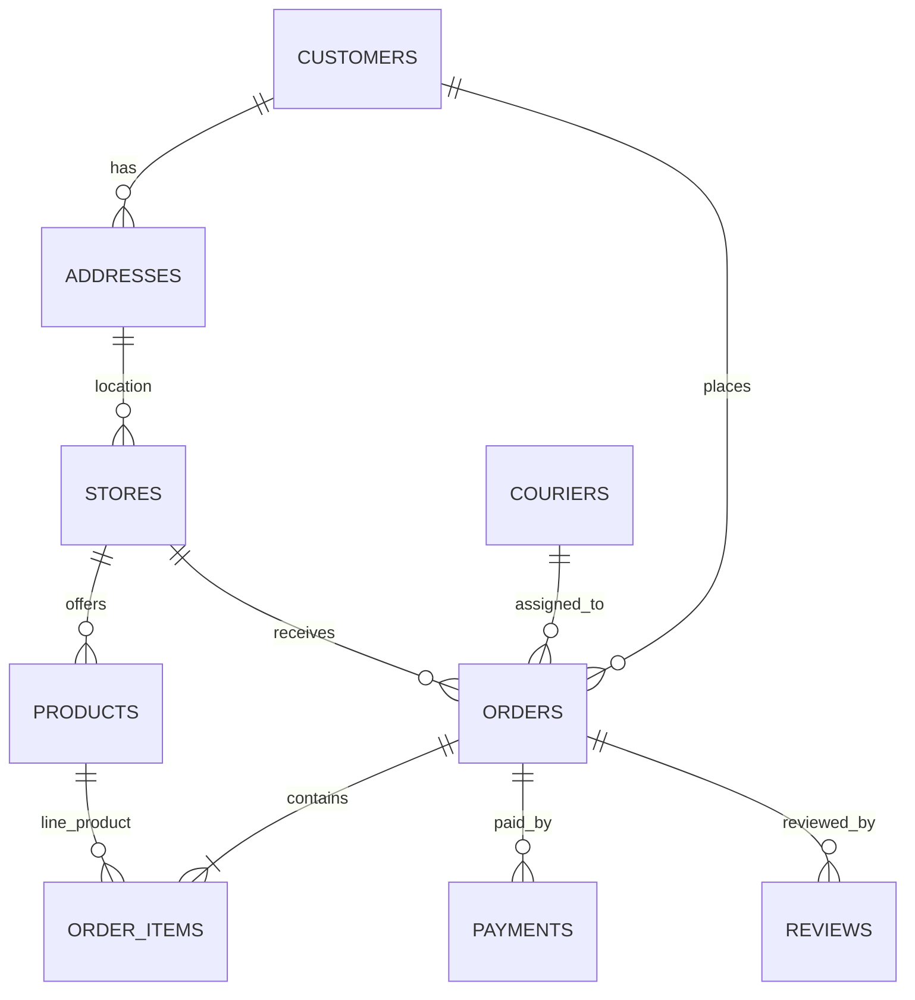
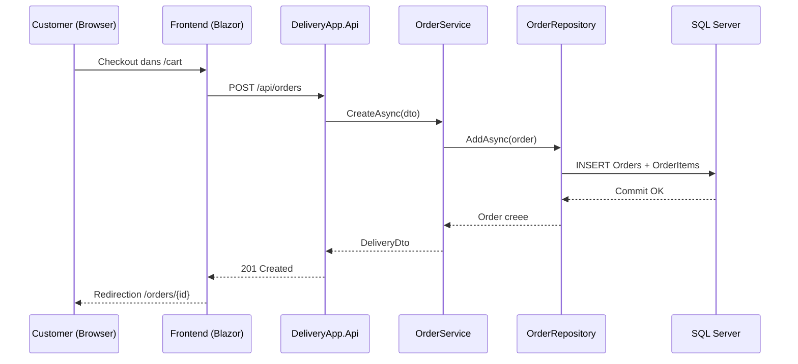
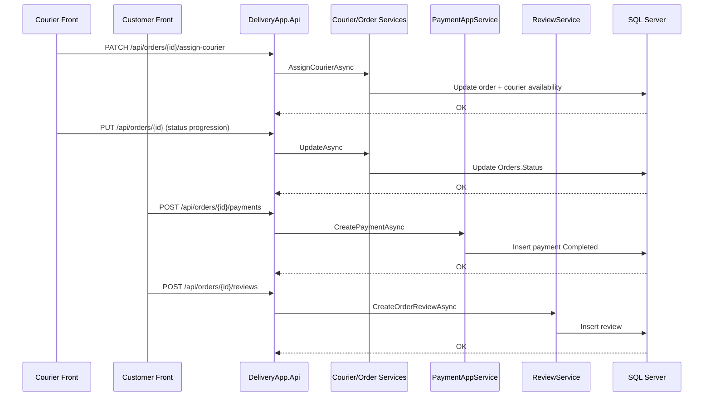

# DeliveryApp - Architecture Document (Projet actuel)

Ce document donne une vue simple et visuelle de l'architecture du projet DeliveryApp.

## 1. Vue globale



## 2. Frontend

### Role dans le projet

- Le frontend est une application `Blazor Server` (`src/DeliveryApp.Frontend`).
- Il orchestre les ecrans selon le role connecte: `Customer`, `Courier`, `Admin`.
- Il appelle l'API backend via `DeliveryApiClient`.

### Composants frontend principaux

- `Program.cs`: configure Razor Components + `DeliveryApiClient` + etats scopes.
- `Components/Routes.razor`: controle d'acces par role (public, customer, courier, admin).
- `Services/AuthSessionState.cs`: session JWT en memoire (token + role + ids).
- `Services/CartState.cs`: etat panier client.
- `Services/AppContextState.cs`: contexte courant (customer/address/courier/order).
- `Services/DeliveryApiClient.cs`: client HTTP centralise pour tous les endpoints.

### Flux frontend simplifie



## 3. Backend layers

### Couches runtime actuelles

- `DeliveryApp.Api`: endpoints, auth JWT, policies (`CustomerOnly`, `CourierOnly`, `AdminOnly`).
- `DeliveryApp.Application`: DTOs, interfaces, validation contracts, `ServiceResult`.
- `DeliveryApp.Service`: logique metier (orders, catalog, courier, payment, review, auth).
- `DeliveryApp.Infrastructure`: EF Core + repositories SQL + migrations.
- `DeliveryApp.Domain`: entites et regles metier (ex: transition de statut commande).

### Vue couche par couche



### Point important sur l'architecture modulaire

- Le repo contient aussi des modules `Modules/*` (Catalog, Ordering, Dispatch, Payments, Identity).
- Aujourd'hui, les routes `/api/modules/*` passent via des adapters qui reutilisent encore les services legacy.
- `Modules.Identity` est un stub (non branche sur le runtime auth principal).

## 4. SQL Server

### Etat actuel

- Base relationnelle active: `SQL Server` via connection string `DefaultConnection`.
- ORM: `EF Core 10` (`Microsoft.EntityFrameworkCore.SqlServer`).
- Contexte principal: `AppDbContext`.
- Migrations presentes dans `src/DeliveryApp.Infrastructure/Data/Migrations`.

### Entites/tables metier principales

- `UserAccounts` (auth + roles)
- `Customers`, `Couriers`
- `Addresses`, `Stores`, `Products`
- `Orders`, `OrderItems`
- `Payments`, `Reviews`

### Relations de donnees (resume)



## 5. Cosmos DB

### Statut dans DeliveryApp

`Cosmos DB n'est pas utilise dans le projet actuel.`

Constat technique dans le code:

- aucun package Cosmos dans les `.csproj`
- aucune configuration Cosmos dans `appsettings*.json`
- aucun repository/service Cosmos dans `src/*`

### Comment on aurait pu l'implementer dans ce projet

Option recommandee (complement SQL, pas remplacement complet):

- garder SQL Server comme source transactionnelle (orders, payments, auth)
- ajouter Cosmos DB pour des donnees denormalisees et lecture rapide

Cas d'usage adaptes a DeliveryApp:

1. `OrderTimeline` (historique complet des changements de statut par commande)
2. `CourierLiveView` (etat quasi temps reel des courses actives)
3. `CustomerOrderReadModel` (vue agregee pre-calculee pour `/api/orders/mine`)

Exemple de document Cosmos (OrderTimeline):

```json
{
  "id": "order-1257-2026-02-24T14:20:33Z",
  "orderId": 1257,
  "customerId": 44,
  "courierId": 9,
  "status": "OutForDelivery",
  "eventType": "OrderStatusChanged",
  "occurredAtUtc": "2026-02-24T14:20:33Z",
  "metadata": {
    "source": "DeliveryApp.Api",
    "actorRole": "Courier"
  }
}
```

Choix de partition possible:

- container `order-timeline`: partition key `/orderId`
- container `customer-orders-readmodel`: partition key `/customerId`

Integration proposee (simple):

1. Transaction SQL validee dans le service metier (ex: `OrderService.UpdateAsync`).
2. Publication d'un evenement interne (ou outbox table SQL).
3. Projecteur asynchrone qui ecrit la vue Cosmos.
4. Nouvel endpoint de lecture rapide sur ces vues.

## 6. Interactions entre composants

### Scenario 1: Creation de commande



### Scenario 2: Dispatch + paiement + avis



## 7. Resume

- Architecture actuelle: frontend Blazor Server + backend .NET en couches + SQL Server.
- Le socle modulaire est present mais encore en migration progressive via adapters.
- Cosmos DB: non implemente aujourd'hui, mais integrable proprement en read-model/event store pour scaler la lecture et le suivi temps reel.
